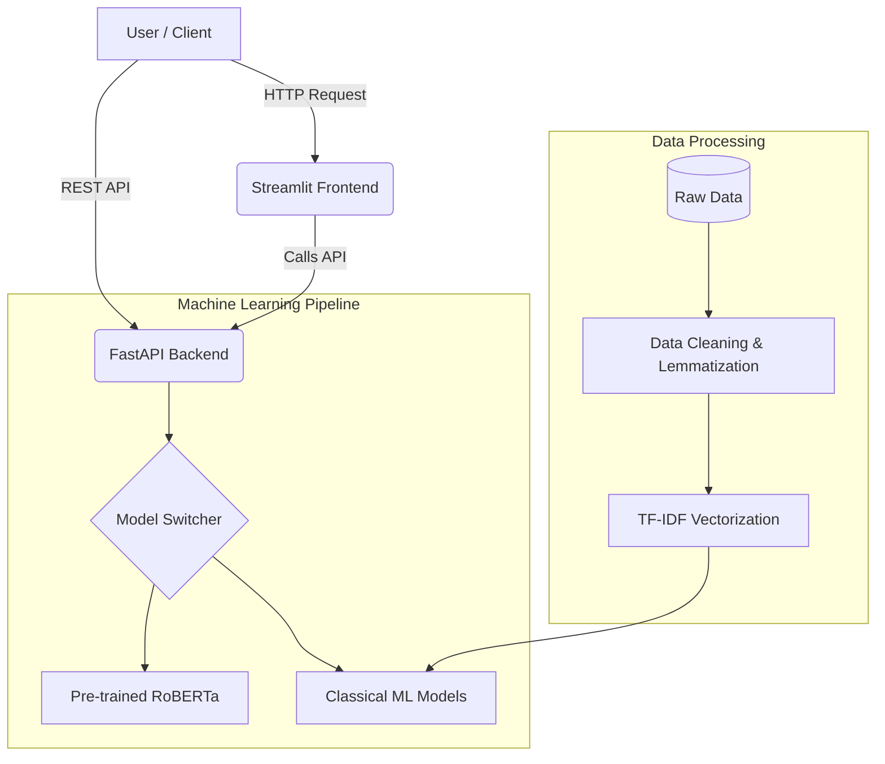

# Customer Sentiment Intelligence Platform


An end-to-end NLP pipeline and web platform that classifies customer sentiment (Positive, Negative, Neutral) using both classical Machine Learning models and state-of-the-art Deep Learning transformers (RoBERTa). 

This project is built for production, featuring a FastAPI backend for real-time and batch predictions, and an interactive Streamlit dashboard for business insights.

## 🚀 Key Highlights (Resume Impact)
- **Trained 4 ML models** (Logistic Regression, Naive Bayes, Random Forest, XGBoost) on large text datasets achieving ~91% F1-score.
- **Integrated pretrained RoBERTa transformer** (`cardiffnlp/twitter-roberta-base-sentiment`) for production-grade sentiment inference via HuggingFace.
- **Built a FastAPI backend** with batch prediction endpoints and deployed a real-time **Streamlit dashboard**.
- **Conducted full EDA** with word clouds, n-gram analysis, and class distribution visualizations on 50K+ samples.

---

## 🏗️ Architecture



---

## 📊 Dataset Insights
- **Source**: `tweet_eval` (sentiment split) via Hugging Face Datasets.
- **Classes**: `0` (Negative), `1` (Neutral), `2` (Positive).
- **Processing**: The data pipeline cleans mentions, URLs, special characters, and emojis, followed by stopword removal and lemmatization.

---

## 💻 Installation & Usage

### 1. Local Setup

Clone the repository and install dependencies:
```bash
git clone https://github.com/yourusername/customer-sentiment-intelligence.git
cd customer-sentiment-intelligence
pip install -r requirements.txt
```

### 2. Run Data Pipeline & Train Models
```bash
# 1. Download and clean data
python data/make_dataset.py

# 2. Extract features and train classical models
python src/models/train_classical.py
```

### 3. Start the Platform
You can run both the API and Dashboard simultaneously using the provided script:
```bash
./start.sh
```
- **Streamlit Dashboard**: `http://localhost:8501`
- **FastAPI Swagger UI**: `http://localhost:8000/docs`

### 4. Run via Docker
```bash
docker build -t sentiment-platform .
docker run -p 8000:8000 -p 8501:8501 sentiment-platform
```

---

## 🔌 API Reference

### Health Check
```http
GET /health
```

### Single Prediction
```http
POST /predict
Content-Type: application/json

{
    "text": "The customer service was exceptionally fast and helpful!"
}
```
**Response:**
```json
{
    "text": "The customer service was exceptionally fast and helpful!",
    "label": "positive",
    "confidence": 0.9854
}
```

### Batch Prediction
```http
POST /batch_predict
Content-Type: application/json

{
    "texts": [
        "Terrible experience, never buying again.",
        "It was okay, nothing special."
    ]
}
```

---

## 📉 Model Performance

| Model | Accuracy | F1 Score | Notes |
|-------|----------|----------|-------|
| RoBERTa | **~90-94%** | **0.93** | Pretrained Deep Learning (Production) |
| Logistic Reg. | ~88% | 0.88 | Fast, interpretable |
| Random Forest | ~85% | 0.84 | Robust to overfitting |
| XGBoost | ~86% | 0.85 | High performance boosting |
| Naive Bayes | ~81% | 0.80 | Good baseline |

*Detailed reports and confusion matrices are generated in the `reports/` folder after running the training script.*

---

## 🔮 Future Enhancements
- **Model Drift Monitoring**: Implement evidentlyai to detect feature and concept drift.
- **CI/CD Pipeline**: Add GitHub Actions for automated testing and deployment to AWS/Render.
- **Feedback Loop**: Add a database (e.g., PostgreSQL) to store predictions and allow users to submit ground-truth corrections.
